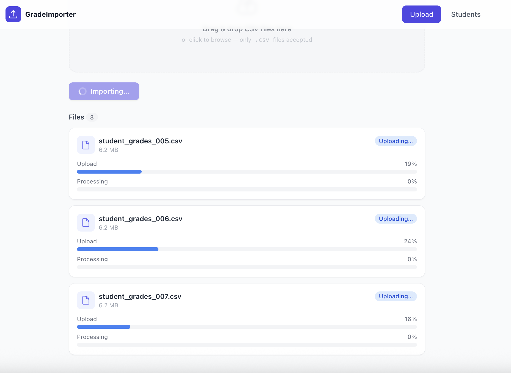
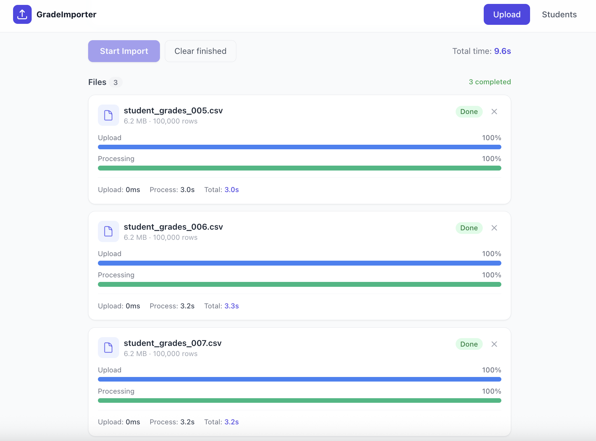
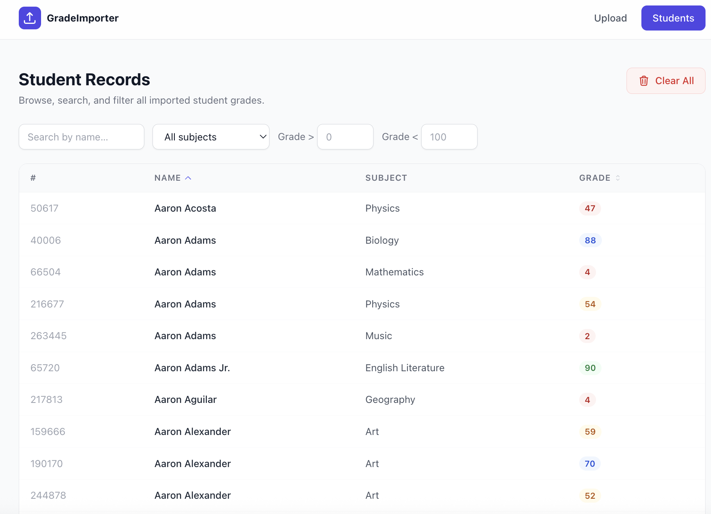
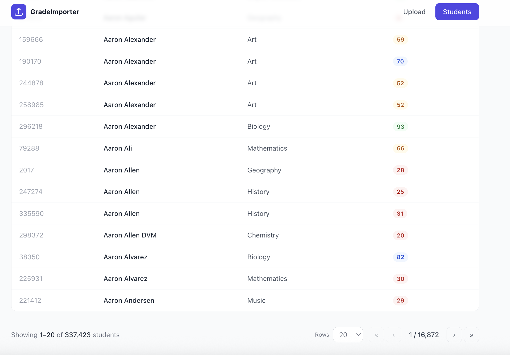
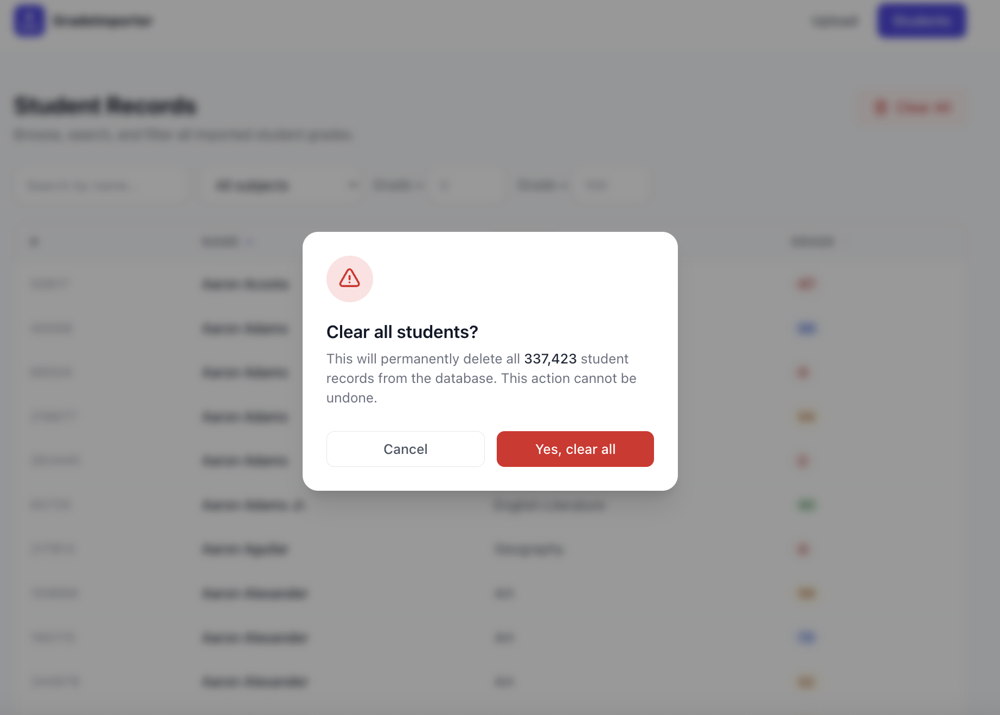
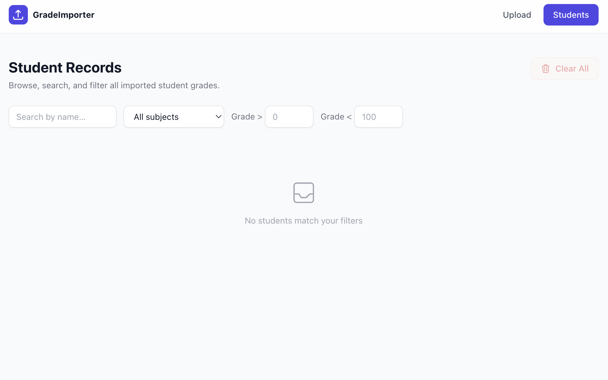

# Frontend — React + TypeScript + Vite

The frontend is a single-page application that lets users upload multiple CSV files simultaneously, watch per-file upload and processing progress in real time, and browse the resulting student records with sorting, filtering, and pagination.

---

## Mobile Support

The UI is responsive and usable on small screens:

- **Navbar** — logo and nav links scale down cleanly on mobile viewports
- **Upload page** — the drop zone, file cards, and progress bars reflow to full width
- **Students page header** — on mobile the title and the "Clear All" button stack vertically (column layout); on `sm+` they sit side by side
- **Filters bar** — on mobile, the name search and subject dropdown expand to full width and stack; the Grade `>` and Grade `<` inputs always share a single row, splitting the available space evenly so they never wrap awkwardly
- **Grade inputs** — restricted to integers 0–100 only; special characters (`e`, `E`, `+`, `-`, `.`) are blocked at the keyboard level and any value above 100 is automatically clamped to 100

---

## Screenshots

### Upload in progress — parallel uploads with per-file progress bars


### Upload completed — all files done with timing metrics


### Student Records listing — sortable, filterable table


### Students pagination — 337,423 records across 16,872 pages


### Clear All confirmation modal


### Empty state — no records in the database


---

## Tech Stack

| Concern | Choice |
|---|---|
| Framework | [React 19](https://react.dev/) |
| Language | TypeScript |
| Build tool | [Vite](https://vite.dev/) |
| Styling | [Tailwind CSS v3](https://tailwindcss.com/) |
| HTTP client | [Axios](https://axios-http.com/) |
| Routing | [React Router v7](https://reactrouter.com/) |
| Progress streaming | Native `EventSource` (SSE) |

---

## Why React + TypeScript + Vite?
- **React** is a mature, widely-used library with a strong ecosystem. Its component model fits well with the UI requirements, and its hooks API allows for clean state management without external libraries. Another framework that could I was thinking of myself was Angular + PrimeNG, but I felt that would be overkill for this project and would slow down development speed.
- **TypeScript** provides static typing, which helps catch bugs early and improves developer experience with autocompletion and documentation in the IDE. The type safety is especially valuable when dealing with asynchronous data from the backend and complex state management.
- **Vite** offers a fast development experience with instant hot module replacement (HMR) and a simple configuration. It also produces optimized builds for production with minimal setup. Compared to something like Create React App, Vite's performance and simplicity are major advantages for a project of this size.

## Prerequisites

- [Node.js 18+](https://nodejs.org/)
- Backend server running on `http://localhost:8080` (see `backend/Readme.md`)

---

## Setup & Run

### Development

```bash
# Install dependencies
npm install

# Start the dev server (http://localhost:5173)
npm run dev
```

The dev server proxies all `/api/*` requests to `http://localhost:8080` automatically (configured in `vite.config.ts`), so no CORS issues occur in local development.

A `.env` file is included with:

```env
VITE_API_BASE=/api
```

This works for both local dev (via Vite proxy) and production (via Nginx reverse proxy).

### Production build

```bash
npm run build      # outputs to dist/
npm run preview    # preview the production build locally
```

---

## Pages

### Upload (`/`)

- **Drag & drop zone** — drag one or more `.csv` files directly onto the zone, or click it to open a file picker. Both flows feed into the same upload queue. Non-CSV files are rejected immediately with an inline error message naming the rejected files.
- **File queue** — files appear as cards the moment they are added. Each card shows:
  - File name and size
  - Status badge (`Pending → Uploading → Processing → Done / Failed`)
  - **Blue progress bar** — upload percentage, driven by Axios `onUploadProgress`
  - **Green progress bar** — processing percentage, driven by SSE events from the backend
  - Upload time, processing time, and total time once the job completes
  - A remove button for pending or finished files
  - Backend error messages are surfaced directly (e.g. `"only .csv files are allowed"`) rather than the generic Axios status string
- **Start Import** — uploads all pending files in parallel (one request per file). The button is disabled while importing is in progress.
- **Overall time** — displayed once every file in the current batch has finished.

### Students (`/students`)

Browse all records stored in the database.

- **Search by name** — partial, case-insensitive match
- **Subject dropdown** — exact match from the 10 available subjects
- **Grade filters** — grade greater than / less than a given number
- **Sortable columns** — click the Name or Grade column header to toggle asc / desc
- **Pagination** — choose rows per page (10 / 20 / 50 / 100) and navigate with first / prev / next / last buttons

---

## Project Structure

```
frontend/src/
├── types/index.ts                     # Shared TypeScript interfaces & constants
├── context/
│   └── UploadContext.tsx              # UploadProvider + useUploadContext — persists state above the router
├── hooks/
│   ├── useUpload.ts                   # Upload state machine + SSE wiring + localStorage persistence
│   └── useStudents.ts                 # Students query, filter, and sort state
├── components/
│   ├── layout/Navbar.tsx              # Sticky top nav with active-link highlighting
│   ├── upload/
│   │   ├── DropZone.tsx               # Drag-and-drop + file input zone
│   │   ├── FileCard.tsx               # Single file — 2 progress bars + timings
│   │   └── FileList.tsx               # List of FileCards with summary header
│   └── students/
│       ├── Filters.tsx                # Name / subject / grade filter controls
│       ├── StudentsTable.tsx          # Sortable data table with grade colour coding
│       └── Pagination.tsx             # Page navigation + rows-per-page selector
├── pages/
│   ├── UploadPage.tsx                 # Composes drop zone + file list + actions
│   └── StudentsPage.tsx               # Composes filters + table + pagination
├── App.tsx                            # BrowserRouter + route definitions
├── main.tsx                           # React root
└── index.css                          # Tailwind directives
```

---

## How the Upload Flow Works

```
User selects / drops files
        │
        ▼
Files added to queue (status: pending)
        │
User clicks "Start Import"
        │
        ▼
For each file (all in parallel):
  1. POST /api/upload  →  Axios onUploadProgress drives upload bar
  2. Receive job_id from response
  3. job_id saved to localStorage (survives tab switches + page refresh)
  4. Open EventSource /api/progress/:jobId
  5. Each SSE event updates the processing bar + timings
  6. On status=completed|failed → close EventSource, remove from localStorage
```

## State Persistence

Upload state is preserved across in-app navigation and page refreshes via two mechanisms:

**Tab switching (in-app navigation)**
`useUpload` is instantiated once inside `UploadProvider` which wraps the entire app above the router. Navigating between `/` and `/students` does not unmount the provider, so all file states and SSE connections remain alive.

**Page refresh / browser close**
When a file receives a `job_id` from the server it is written to `localStorage` (key: `grade_importer_jobs`). On next page load, `useUpload` reads localStorage in its `useState` initialiser — restored jobs appear immediately as `processing`. A `useEffect` then reconnects SSE streams for each restored job. When the SSE receives a terminal event (`completed` or `failed`) the entry is removed from localStorage automatically.

> **Note:** The browser `File` object cannot be persisted — restored jobs display their file name and size (saved in localStorage) but cannot be re-uploaded. They are read-only cards that update to their final state via SSE.

---

## Research Decision Record

**React + Vite over Next.js**
I chose plain React with Vite over Next.js because this is a client-only SPA with no need for server-side rendering or static generation. Vite's HMR is faster than Next.js's dev server for this kind of project, and the bundle stays smaller without the Next.js runtime.

**Tailwind CSS over a component library (MUI, Chakra)**
I chose Tailwind over a pre-built component library because the UI requirements are specific enough that component-library defaults would have needed heavy overriding anyway. Tailwind gives full control with no specificity battles, and the utility classes keep all styling co-located with the JSX.

**Native EventSource over a WebSocket or polling**
I chose the browser's built-in `EventSource` over WebSockets or `setInterval` polling because the progress stream is strictly one-directional. `EventSource` reconnects automatically on network hiccups, requires no library, and works through standard HTTP infrastructure — no upgrade handshake needed.

**One Axios request per file over a single multipart request with all files**
I chose uploading files individually in parallel rather than bundling them into a single multipart request because it gives a separate `onUploadProgress` callback per file. This is what makes the individual upload progress bars possible; a single request would only expose combined progress.

**Custom hooks (`useUpload`, `useStudents`) over a global state library (Redux, Zustand)**
I chose co-located custom hooks over a global store because the upload state is local to the upload page and the students state is local to the students page — they never need to share data. Adding a global store would be accidental complexity for what is effectively two independent state machines.

---

## Testing

### Stack

| Tool | Role |
|---|---|
| [Vitest](https://vitest.dev/) | Test runner — native Vite integration, Jest-compatible API |
| [React Testing Library](https://testing-library.com/react) | Component rendering and user interaction |
| [user-event](https://testing-library.com/docs/user-event/intro/) | Realistic browser event simulation (typing, clicking, selecting) |
| [@testing-library/jest-dom](https://github.com/testing-library/jest-dom) | DOM matchers — `toBeInTheDocument`, `toBeDisabled`, etc. |
| [jsdom](https://github.com/jsdom/jsdom) | Simulated browser environment for Node |

### Running the tests

```bash
# Run all tests once
npm test

# Watch mode (re-runs on file change)
npm run test:watch

# Generate coverage report (outputs to coverage/)
npm run coverage
```

> All tests are pure unit/component tests. No backend server or network connection is needed.

---

### Test files

#### `src/components/students/StudentsTable.test.tsx`

Tests the sortable data table that displays student records. The component is stateless — it receives students, current filter state, and an `onSort` callback as props.

| Test | Goal |
|---|---|
| `renders empty state when there are no students` | When passed an empty array, the table must render the "No students match your filters" placeholder and no `<tr>` rows. |
| `renders a row for each student` | Given two students, both names must appear in the document. |
| `renders subject and grade values` | Subject and numeric grade values must appear in the correct cells. |
| `calls onSort with student_name when Name header is clicked` | Clicking the Name column header must invoke `onSort("student_name")` exactly once. |
| `calls onSort with grade when Grade header is clicked` | Clicking the Grade column header must invoke `onSort("grade")` exactly once. |
| `does not call onSort when clicking non-sortable Subject header` | The Subject column is not a `SortableTh` — `onSort` must never be called just from rendering. |
| `shows asc sort icon on active sort column` | When `sortBy=student_name` and `sortOrder=asc`, the Name header's SVG must carry the `indigo` colour class (active indicator). |
| `shows desc sort icon when sortOrder is desc` | When `sortBy=grade` and `sortOrder=desc`, the Grade header's SVG must carry the `indigo` colour class. |

---

#### `src/components/students/Filters.test.tsx`

Tests the filter bar that drives the student query — name search, subject dropdown, grade comparators, and the conditional Clear button.

| Test | Goal |
|---|---|
| `renders the name search input` | The name input with placeholder "Search by name…" must be present on mount. |
| `renders subject dropdown with all subjects` | Every one of the 10 subjects defined in `SUBJECTS` must appear as a `<option>` in the subject select. |
| `calls onChange with name delta when typing in name input` | Typing three characters must call `onChange` three times, each time with the latest single-character delta — verifies the controlled-input wiring. |
| `calls onChange with subject when dropdown changes` | Selecting "Mathematics" from the dropdown must call `onChange({ subject: "Mathematics" })`. |
| `calls onChange with gradeGt when grade > input changes` | Typing into the grade-greater-than field must call `onChange({ gradeGt: <value> })`. |
| `calls onChange with gradeLt when grade < input changes` | Typing into the grade-less-than field must call `onChange({ gradeLt: <value> })`. |
| `does not show clear button when no filters active` | With all filter fields empty, the "Clear filters" button must not be rendered. |
| `shows clear button when name filter is active` | When `name` is non-empty, the "Clear filters" button must appear in the DOM. |
| `clicking clear filters resets all filter fields` | Clicking "Clear filters" must call `onChange({ name: "", subject: "", gradeGt: "", gradeLt: "" })` — a single call that resets all four fields at once. |

---

#### `src/components/students/Pagination.test.tsx`

Tests the page navigation bar — the showing summary, the rows-per-page selector, and all four navigation buttons with their disabled states.

| Test | Goal |
|---|---|
| `shows the current page and total pages` | The text `1 / 5` must appear to indicate current page and total pages. |
| `shows the correct "Showing X–Y of Z students" text` | On page 2 with page size 20 and 100 total records, the summary must show `21–40 of 100`. |
| `disables First and Previous buttons on page 1` | On the first page, the «  and ‹ buttons must both be `disabled` so the user cannot go before page 1. |
| `disables Next and Last buttons on the last page` | On the last page, the › and » buttons must both be `disabled`. |
| `enables all nav buttons on a middle page` | On a middle page (3 of 5), all four navigation buttons must be enabled. |
| `calls onPage(1) when First button is clicked` | Clicking « must call `onPage(1)` regardless of the current page. |
| `calls onPage(page-1) when Previous is clicked` | Clicking ‹ on page 3 must call `onPage(2)`. |
| `calls onPage(page+1) when Next is clicked` | Clicking › on page 3 must call `onPage(4)`. |
| `calls onPage(totalPages) when Last is clicked` | Clicking » must call `onPage(totalPages)`. |
| `calls onPageSize with selected value when rows dropdown changes` | Selecting `50` from the rows-per-page dropdown must call `onPageSize(50)` with the numeric value (not a string). |
| `renders all available page size options` | The options 10, 20, 50, and 100 must all be present in the dropdown. |

---

#### `src/components/upload/DropZone.test.tsx`

Tests the drag-and-drop file input zone — CSV filtering, drag visual feedback, the `disabled` prop, and the hidden file input attributes.

| Test | Goal |
|---|---|
| `renders the drag & drop prompt text` | The zone must display the "Drag & drop CSV files here" label on mount. |
| `renders the hidden file input with csv accept and multiple` | The underlying `<input type="file">` must have `accept=".csv"` and the `multiple` attribute, so the OS file picker is pre-filtered. |
| `calls onFiles with CSV files selected via input` | Uploading a `.csv` file via the hidden input must call `onFiles` once with an array containing that file. |
| `filters out non-CSV files on input change` | Uploading a `.txt` file must not call `onFiles` at all — only CSV files pass through. |
| `calls onFiles with CSV files when dropped` | Dropping a `.csv` file onto the zone must trigger `onFiles` with the dropped file. |
| `filters non-CSV files on drop` | Dropping a `.png` file must not call `onFiles` — the same CSV-only filter applies to drag-and-drop. |
| `applies dragging styles on dragover` | While dragging over the zone, its class list must include the indigo highlight classes. |
| `removes dragging styles on dragleave` | After the drag leaves the zone, the indigo highlight must be removed. |
| `does not change drag style when disabled` | When the `disabled` prop is set, dragging over the zone must not apply highlight styles. |
| `does not call onFiles when disabled and files are dropped` | When `disabled`, dropping valid CSV files must still not call `onFiles`. |
